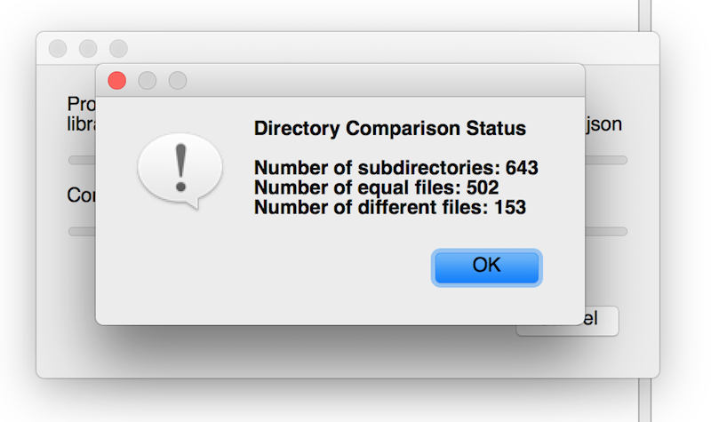

class: center, middle
# Bug Free, By Design
21 ways to make code resistent to bugs without talking about tests!

.footnote[.red.bold[@johan_alps], Developer]

---
class: center

# Bugs...

--

.middle[]

---
class: split-40, center
# Design 

--
.column[]

.column[]


???
Pay more attention!

---
background-image: url(gertie3.jpg)

---
background-image: url(crash-test.jpg)


---
background-image: url(Car-crash-old.jpg)


---
background-image: url(Car-crash-modern.jpg)

---
# Poka Yoke
Improve the system - Funnel of feedback

--

.left[]

---
class: split-50, middle
# Whenever there's a bug
.column[

When was it introduced? Why?

Which elements made it more likely? Why?

Could we bring detection further up in the funnel?
]

--
.column[]

---
### Any ideas?

.center[]


---
# Priorities
1. Make the errors impossible
2. Compensate for them
2. Make them less likely
3. Document the correct use

---
class: center
# Making errors impossible

.center[]

---
# Making errors impossible
- Unconstrained construction
- Temporal coupling
- Primitive Obsession
- Couplage sans cohésion

---
background-image: url(madeleinemold.jpg)
# Constrain construction

--
```java
    public Menu() {
        // Can I have only starter and main course?
    }
```
--

```java
    public Menu(String mainCourse, String starter, String dessert) {
        // beware of ordering...
    }

```
--

```java
    public Menu(MainCourse mainCourse, Starter starter, Dessert dessert) {
        // oh yeah!
    }
```
--

```typescript
    // in languages where you have only one constructor
    // Factory methods / Named constructors
    public static mainCourseAndStarter(mainCourse, starter) {}
    public static mainCourseAndDessert(mainCourse, dessert) {}
    public static fullMenu(mainCourse, starter, dessert) {}
``` 

---
# Temporal coupling


```typescript
    let buggyConnector = new BuggyConnector(port);
    buggyConnector.connect(); // we can forget this
    buggyConnector.putData("hello");
```
--

```typescript    
    new Connector(port)
        .connect() // impossible to forget
        .putData("hello");

```

--

```typescript
	class Connector {
	    connect() {
	        return new OpenConnection()
	    }	
	}
	
	class OpenConnection {
	    putData() { ... }	
	}
```
---

# More temporal coupling

Exception?
```javascript
		const ticTacToe = new TicTacToe();
		ticTacToe.occupyX(1, 1);
		ticTacToe.occupyO(0, 1);
		ticTacToe.occupyO(0, 0);
```

--

No error possible
```typescript
		const ticTacToe = new TicTacToe();
		ticTacToe.occupy(1, 1);
		ticTacToe.occupy(0, 1);
		ticTacToe.occupy(0, 0);  
```

--

Or immutable
```typescript
		const ticTacToe = new TicTacToeX()
			.occupy(1, 1); // instanceOf TicTacToeY is returned
			.occupy(0, 1);
			.occupy(0, 0);  
```


---

# Primitive Obsession

```typescript
		ticTacToe.occupy(1, 1);
```

--

```typescript
		ticTacToe.occupy(2, 3); // illegal input?
```

---

# No Primitive Obsession

```typescript
		const ticTacToe = new TicTacToe();
		ticTacToe.occupy(MIDDLE, CENTER);
		ticTacToe.occupy(UPPER, LEFT);
```

--

```typescript
		enum Row {
		    UPPER, MIDDLE, LOWER,
		}
		
		enum Column {
		    LEFT, CENTER, RIGHT,
		}
		
		class TicTacToe {
		
		    public occupy(row: Row, column: Column) {
		        // ...
		    }
		    
```

---
# Assertions are replaced by the compiler
```typescript

    public occupyX(row: number, column: number) {
        this.assertIsPlayerYTurn('X');
        this.assertIsInsideLimits(row, column);
        // ...
    }
```

---
# Going further with types
```typescript
    public occupyX(row: number, column: number) {
        this.assertIsPlayerYTurn('X');
        this.assertIsInsideLimits(row, column);
        this.assertBoardHasFreeCells(); // <<===== 
        // ...
    }
```

---
# Going further with types
Can't make more than 9 placements
--
.left[]

---

```typescript
interface ITicTacToe<NextState> {
    occupy(row, column): NextState;
}
```
--
```typescript
class NewGame implements ITicTacToe<SecondState> {
    public occupy(row, column): SecondState {
        return new SecondState();
    }
}

class SecondState implements ITicTacToe<ThirdState> {
    public occupy(row, column): ThirdState {
        return new ThirdState();
    }
}
```
--
```typescript
class NinthState implements ITicTacToe<EndState> {
    public occupy(row: any, column: any): EndState {
        return new EndState();
    }
}

class EndState  {
}
```

---
class: center, middle
# Coupling without cohesion
Demo time!

---
background-image: url(trivial.jpg)


---
# Hidden testable code

```typescript
		let data = callToDependency()
		//
		// pure logic
		// pure logic
		// pure logic
		// pure logic
		// pure logic
		//
		callToDependency2(transformedData)
```

---
# Hidden testable code
```typescript

requestExternalServer().then((key) =>
    persistence.get(key)).then(result => {

        const langToUpdate = {};
        versionsLangs.map((versionLang) => {
            let restPath = versionLang.entity.toRestPath();

            result.dates.langsDates.map(datePayload => {
                if (restPath === datePayload.langRestPath) {
                    langToUpdate[restPath] = langToUpdate[restPath] || {};
                    langToUpdate[restPath].dates = datePayload.payload.dates;
                }
            });

        });
        return persistence.update(key, langToUpdate)
})
```
--
Extract pure function

---
# Hidden testable code
```typescript

requestExternalServer().then(() =>
    persistence.get(key)).then(result => {
        let langToUpdate = makeLang(key, result)
        return persistence.update(key, langToUpdate)
})

function makeLang(key, result) {
	const langToUpdate = {};
	versionsLangs.map((versionLang) => {
	    let restPath = versionLang.entity.toRestPath();
	
	    result.dates.langsDates.map(datePayload => {
	        if (restPath === datePayload.langRestPath) {
	            langToUpdate[restPath] = langToUpdate[restPath] || {};
	            langToUpdate[restPath].dates = datePayload.payload.dates;
	        }
	    });
	});
	return langToUpdate;

}
```

---
## Edge-less code
Reduce cognitive load. Reduce the number of possibilities.

- If-less 
	- Option, List, Map/Dictionary, NullObject, Polymorphisme
- lambdas 
	- ex filter
- Eliminate exceptions

## Small methods
  - Focused code, less possibilities

## Immutability
  - no time vector
  - no implicit messages

---

# Conditional logic and use of indices
Git log
* fix suppression
* correction suppression
* fix delete
...
--

```typescript
   private findPokerFaceIndex(srcPokerFaces, updatePockerFace){
        const indexToDelete = [];
        let indexOriginal = 0;
        srcPokerFaces.forEach((pokerFaceOriginal) => {
            let index = 0;
            while (index < updatePockerFace.length 
	            && updatePockerFace[index].alternativeFaceId !==
	             pokerFaceOriginal.alternativeFaceId) {
                index++;
            }
            console.log("@@@@@@@@@@@@@@@@@@@@@@@@@@@@@@@@@@@@@",
	            index === srcPokerFaces.length,index , updatePockerFace.length)
            if (index === updatePockerFace.length) {
                console.log("@@@@@@@@@@@@@@@@@@@@@@@@@@@@@@@@@@@@@tetst")
                indexToDelete.push(indexOriginal + 1);
            }
            indexOriginal++;
        });
        return indexToDelete;
    }
```

---

# Conditional logic and use of indices
Git log
* fix suppression
* correction suppression
* fix delete
...

--
## Non readable code

--
## Missing abstraction: cascade delete on foreign keys

---
# C'est nul! 
>  I call it my billion-dollar mistake. It was the invention of the null reference in 1965
>
> -- <cite>Tony Hoare - quick sort inventor</cite>

--

```javascript
  /** 
   * javascript <3 <3 <3
   */
  function nullCestNul(value) {
     if (value == null)
	       return undefined
  }
```

---

# #NoNull

## Non nullable types!
typescript, kotlin, ...


--
## Elsewhere
What if we never returned null?

---
class: center
# Compensate for errors

.top[]

--

Fix the design, not the configuration.
--

```typescript
Url.join(hostname, path) 
```
--

```typescript
socketHost.appendPath(path)
```

---
## Documentation

```java
/** 
 * When the design is intuitive documentation is useless 
 */
```

--

But sometimes documentation is useful...

---
background-image: url(toilet_documentation_s.jpg)

---
layout: true
## Coupling and cohesion...

... Micro service configuration (hell)

---

.top[]

---

.top[]

---
.top[]

---
.top[]

---
.bottom[]

---
layout: false


# Suggestion for tomorrow
1. Next bug: Why? What can we change?
2. Code reviews with error proneness in mind
3. Beware of Primitive Obsession
4. Train yourself [BugsZero Kata](https://github.com/martinsson/BugsZero-Kata)
5. Watch a presentation by Arlo Belshee

.footnote[.red.bold[@johan_alps    
martinsson.johan@blogspot.com ]]

---


