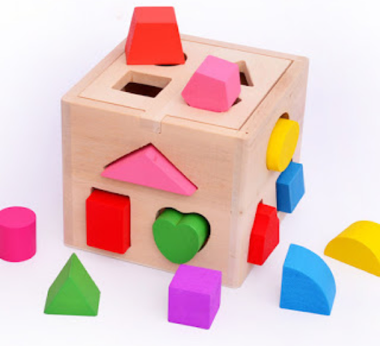

class: center, middle
# Bug Free, By Design
21 facons de rendre son code résistant aux bugs sans parler de tests!

.footnote[.red.bold[@johan_alps], Developer]

---
class: center

# Bugs...

--

.middle[]

---
class: split-40, center
# Design

--
.column[]

.column[]


???
Fais plus attention!

---
# Agenda
1. Poka Yoke - améliorer le système
2. Rendre les erreurs impossibles
3. Corriger les erreurs
4. Orienter - Documentation
5. Exemple en micro services


---
# Poka Yoke
Améliorer le système - Entonnoir de feedback

--

.left[]

---
class: split-50, middle
# Lorsq'un bug arrive. 
.column[

A quel moment a-t-il été introduit? Pourquoi?

Quels éléments ont favorisé son apparition?

Peut-on ramener la détection plus haut dans l'entonnoir?
]

--
.column[]

---
### Quelques catalyseurs de bugs
- Duplication? 
- Code complexe?
- Primitives?
- Formatage? (Arlo Belshee)
- Erreurs dans les logs trop courants?
- Modification multi-repo?
- ...

--
### Quelques solutions
- Un script?
- Dialogue avec PO basé sur exemples?
- Besoin de données de production?
- Typage statique
- Test automatiques? TDD?
- Refactoring
- ...

---
class: center
# Rendre les erreurs impossibles

.center[]

---
# Rendre les erreurs impossibles
## Construction d'objets

```java
    public Menu() {
        // Puis-j'avoir entrée-plat seulement?
    }
```
--

```java
    public Menu(String mainCourse, String starter, String dessert) {
        // attention à l'ordre...
    }

```
--

```java
    public Menu(MainCourse mainCourse, Starter starter, Dessert dessert) {
        // oh yeah!
    }
```
--


```javascript
    static starterAndMainCourse(starter, mainCourse) {
        // in languages where you have only one constructor
        // Factory method / Named constructor
    }
``` 


---
# Rendre les erreurs impossibles
- Instantiation en 2 fois
- Couplage temporel
- Primitive Obsession
- Couplage sans cohésion

---
# Couplage temporel


```typescript
    let buggyConnector = new BuggyConnector(port);
    buggyConnector.connect(); // we can forget this
    buggyConnector.putData("hello");
```
--

```typescript    
    new Connector(port)
        .connect() // impossible to forget
        .putData("hello");

```

--

```typescript
	class Connector {
	    connect() {
	        return new OpenConnection()
	    }	
	}
	
	class OpenConnection {
	    putData() { ... }	
	}
```
---
# Couplage temporel encore

```javascript
describe('TicTacToe', () => {
    it('can blow up!', () => {
        const ticTacToe = new TicTacToe();
        ticTacToe.occupyX(1, 1);
        ticTacToe.occupyY(0, 1);
        ticTacToe.occupyY(0, 0);
    });
});
```

--

```typescript
describe('TicTacToe', () => {
    it("just works!", () => {
        const ticTacToe = new TicTacToe();
        ticTacToe.occupy(1, 1);
        ticTacToe.occupy(0, 1);
        ticTacToe.occupy(0, 0);
    });
});
```


---

# Primitive Obsession

```typescript
ticTacToe.occupy(1, 1);
```

--

```typescript
ticTacToe.occupy(2, 3); // illegal input?
```

---
# No Primitive Obsession

```typescript
describe('TicTacToe', () => {
    it("Look ma, can't put outside board!", () => {
        const ticTacToe = new TicTacToe();
        ticTacToe.occupy(MIDDLE, CENTER);
        ticTacToe.occupy(UPPER, LEFT);
    });
});
```

--

```typescript
enum Row {
    UPPER, MIDDLE, LOWER,
}

enum Column {
    LEFT, CENTER, RIGHT,
}

class TicTacToe {

    public occupy(row: Row, column: Column) {
        // ...
    }
    
```

---
# Assertions remplacés par les types
```typescript

    public occupyY(row: number, column: number): any {
        this.assertIsPlayerYTurn('Y');
        this.assertIsInsideLimits(row, column);
        // ...
    }
```

---
# Types avancées
```typescript
    public occupyY(row: number, column: number): any {
        this.assertIsPlayerYTurn('Y');
        this.assertIsInsideLimits(row, column);
        this.assertBoardHasFreeCells(); // <<=====
        // ...
    }
```

---
# Types avancées
On ne peut jouer que 9 fois.
--
.left[]

---

```typescript
interface ITicTacToe<NextState> {
    occupy(row, column): NextState;
}
```
--
```typescript
class NewGame implements ITicTacToe<SecondState> {
    public occupy(row, column): SecondState {
        return new SecondState();
    }
}

class SecondState implements ITicTacToe<ThirdState> {
    public occupy(row, column): ThirdState {
        return new ThirdState();
    }
}
```
--
```typescript
class NinthState implements ITicTacToe<EndState> {
    public occupy(row: any, column: any): EndState {
        return new EndState();
    }
}

class EndState  {
}
```

---
class: center, middle
# Couplage sans cohésion
Demo time!

---
# Code testable caché

```typescript
let data = callToDependency()
//
// pure logic
// pure logic
// pure logic
// pure logic
// pure logic
//
let dataOther = callToDependency2()
```

---
# Code testable caché
```typescript

requestExternalServer().then(() =>
    persistence.get(key)).then(result => {

        const langToUpdate = {};
        versionsLangs.map((versionLang) => {
            let restPath = versionLang.entity.toRestPath();

            result.dates.langsDates.map(datePayload => {
                if (restPath === datePayload.langRestPath) {
                    langToUpdate[restPath] = langToUpdate[restPath] || {};
                    langToUpdate[restPath].dates = datePayload.payload.dates;
                }
            });

        });
        return persistence.update(key, langToUpdate)
})
```
--
Extract pure function

---
# Code testable caché
```typescript

requestExternalServer().then(() =>
    persistence.get(key)).then(result => {
				let langToUpdate = makeLang(key, result)
        return persistence.update(key, langToUpdate)
})

function makeLang(key, result) {
	const langToUpdate = {};
	versionsLangs.map((versionLang) => {
	    let restPath = versionLang.entity.toRestPath();
	
	    result.dates.langsDates.map(datePayload => {
	        if (restPath === datePayload.langRestPath) {
	            langToUpdate[restPath] = langToUpdate[restPath] || {};
	            langToUpdate[restPath].dates = datePayload.payload.dates;
	        }
	    });
	});
	return langToUpdate;

}
```

---
## Edge-less code
Réduction de charge cognitive. Nombre de cas possibles

- If-less
- lambdas 
	- ex filter
- Eliminer exceptions

## Petites méthodes  
  - Code focalisé, moins de possibilités

## Etat immuable
  - pas de vecteur temps
  - pas de messages implicites


---
# C'est nul!
>  I call it my billion-dollar mistake. It was the invention of the null reference in 1965
>
> -- <cite>Tony Hoare - quick sort inventor</cite>

--

## Javascript

```javascript
  /** 
   * javascript <3 <3 <3
   */
  function nullCestNul(value) {
     if (value == null)
	       return undefined
  }
```

--
## D'autres langages font autrement
Non nullable types!

---
class: center, middle
# Corriger les erreurs

Eviter de corriger la config:
--
.top[]

--

Rendre le code résistant


---
## Documentation

```java
/** 
 * Lorsque le design est intuitive, la documentation est inutile. 
 */
```

--

Mais parfois la documentation est utile...

---
.right[]

---
## Documentation
> Documentation is hard because of 'cache invalidation and naming things'
>
> -- <cite>Inspired by Phil Carlton</cite>

La documentation a un coût. 

---
layout: true
## Couplage et cohésion...

... Micro service configuration (hell)

---

---
.top[]

---
.top[]

---
.top[]

---
.bottom[]

---
layout: false

# Une étude de cas

- Manque de tests (fonction pure caché dans du code non testable)
- Calling non-existing method
- Configs
- lambdas au lieu de for/while
- Compteur parallèle 


---

# Proposition pour demain
1. Au prochain bug: pourquoi? Que peut-on changer?
2. Lire du code sous cet angle
3. Se méfier des primitives 

---
class: center, middle
# Merci!


